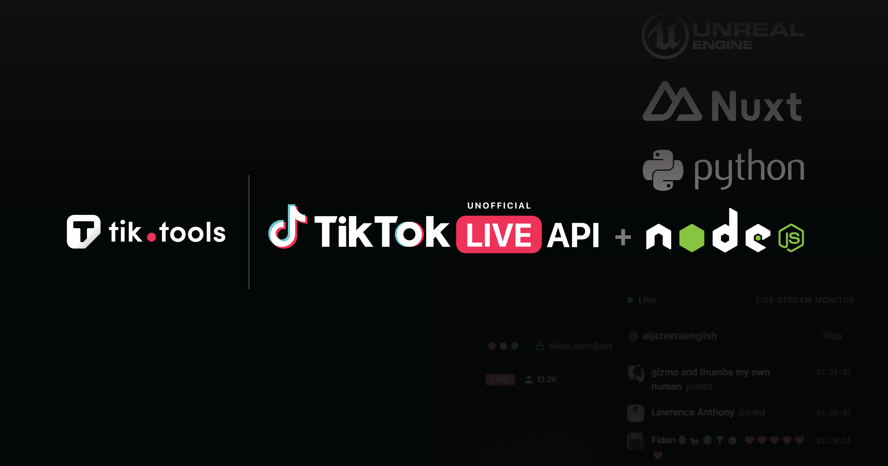

<p align="center">
  
</p>

# tiktok-live-api

**Unofficial TikTok LIVE API Client for Node.js & TypeScript** — Connect to any TikTok LIVE stream and receive real-time chat messages, gifts, likes, follows, viewer counts, battles, and more. Includes AI-powered live captions (speech-to-text). Powered by the [TikTool](https://tik.tools) managed API.

[](https://www.npmjs.com/package/tiktok-live-api)
[](https://www.npmjs.com/package/tiktok-live-api)
[](https://www.typescriptlang.org/)
[](https://github.com/tiktool/tiktok-live-api/blob/main/LICENSE)
[](https://discord.gg/y8TwuFBAmD)

<p align="center">
  
</p>
<<<<<<< HEAD

> **99.9% uptime** — Never breaks when TikTok updates. No protobuf, no reverse engineering, no maintenance. Also available for [Python](https://pypi.org/project/tiktok-live-api/), [Java, Go, C#, and any language via WebSocket](https://tik.tools/docs).
=======
>>>>>>> ac7990ac0be77c4206d9d8fa0bccbe1c85a2bbe6

> This package is **not affiliated with or endorsed by TikTok**. It connects to the [TikTool Live](https://tik.tools) managed API service — 99.9% uptime, no reverse engineering, no maintenance required. Also available for [Python](https://pypi.org/project/tiktok-live-api/) and [any language via WebSocket](https://tik.tools/docs).

## Install

```bash
npm install tiktok-live-api
```

```bash
# or with yarn / pnpm / bun
yarn add tiktok-live-api
pnpm add tiktok-live-api
bun add tiktok-live-api
```

## Quick Start

```typescript
import { TikTokLive } from 'tiktok-live-api';

const client = new TikTokLive('streamer_username', { apiKey: 'YOUR_API_KEY' });

client.on('chat', (event) => {
  console.log(`${event.user.uniqueId}: ${event.comment}`);
});

client.on('gift', (event) => {
  console.log(`${event.user.uniqueId} sent ${event.giftName} (${event.diamondCount} 💎)`);
});

client.on('like', (event) => {
  console.log(`${event.user.uniqueId} liked (total: ${event.totalLikes})`);
});

client.on('follow', (event) => {
  console.log(`${event.user.uniqueId} followed!`);
});

client.on('roomUserSeq', (event) => {
  console.log(`${event.viewerCount} viewers watching`);
});

client.connect();
```

That's it. **No complex setup, no protobuf, no reverse engineering, no breakages when TikTok updates.**

---

## 🚀 Try It Now — 5-Minute Live Demo

Copy-paste this into a file and run it. Connects to a live TikTok stream, prints every event for 5 minutes, then exits. Works on the free Sandbox tier.

**Save as `demo.mjs` and run with `node demo.mjs`:**

```javascript
// demo.mjs — TikTok LIVE in 5 minutes
// npm install tiktok-live-api
import { TikTokLive } from 'tiktok-live-api';

const API_KEY       = 'YOUR_API_KEY';        // Get free key → https://tik.tools
const LIVE_USERNAME = 'tv_asahi_news';       // Any live TikTok username

const client = new TikTokLive(LIVE_USERNAME, { apiKey: API_KEY });
let events = 0;

client.on('chat',        e => { events++; console.log(`💬 ${e.user.uniqueId}: ${e.comment}`); });
client.on('gift',        e => { events++; console.log(`🎁 ${e.user.uniqueId} sent ${e.giftName} (${e.diamondCount}💎)`); });
client.on('like',        e => { events++; console.log(`❤️  ${e.user.uniqueId} liked × ${e.likeCount}`); });
client.on('member',      e => { events++; console.log(`👋 ${e.user.uniqueId} joined`); });
client.on('follow',      e => { events++; console.log(`➕ ${e.user.uniqueId} followed`); });
client.on('roomUserSeq', e => { events++; console.log(`👀 Viewers: ${e.viewerCount}`); });

client.on('connected',    () => console.log(`\n✅ Connected to @${LIVE_USERNAME} — listening for 5 min...\n`));
client.on('disconnected', () => console.log(`\n📊 Done! Received ${events} events.\n`));

client.connect();
setTimeout(() => { client.disconnect(); }, 300_000);
```

<details>
<summary><strong>🔌 Pure WebSocket version (no SDK, any language)</strong></summary>

```javascript
// ws-demo.mjs — Pure WebSocket, zero SDK
// npm install ws
import WebSocket from 'ws';

const API_KEY       = 'YOUR_API_KEY';
const LIVE_USERNAME = 'tv_asahi_news';

const ws = new WebSocket(`wss://api.tik.tools?uniqueId=${LIVE_USERNAME}&apiKey=${API_KEY}`);
let events = 0;

ws.on('open', () => console.log(`\n✅ Connected to @${LIVE_USERNAME} — listening for 5 min...\n`));
ws.on('message', (raw) => {
  const msg = JSON.parse(raw);
  events++;
  const d = msg.data || {};
  const user = d.user?.uniqueId || '';
  switch (msg.event) {
    case 'chat':        console.log(`💬 ${user}: ${d.comment}`); break;
    case 'gift':        console.log(`🎁 ${user} sent ${d.giftName} (${d.diamondCount}💎)`); break;
    case 'like':        console.log(`❤️  ${user} liked × ${d.likeCount}`); break;
    case 'member':      console.log(`👋 ${user} joined`); break;
    case 'roomUserSeq': console.log(`👀 Viewers: ${d.viewerCount}`); break;
    case 'roomInfo':    console.log(`📡 Room: ${msg.roomId}`); break;
    default:            console.log(`📦 ${msg.event}`); break;
  }
});
ws.on('close', () => console.log(`\n📊 Done! Received ${events} events.\n`));

setTimeout(() => ws.close(), 300_000);
```

</details>

---

## JavaScript (CommonJS)

```javascript
const { TikTokLive } = require('tiktok-live-api');

const client = new TikTokLive('streamer_username', { apiKey: 'YOUR_API_KEY' });
client.on('chat', (e) => console.log(`${e.user.uniqueId}: ${e.comment}`));
client.connect();
```

## Get a Free API Key

1. Go to [tik.tools](https://tik.tools)
2. Sign up (no credit card required)
3. Copy your API key

The free Sandbox tier gives you 50 requests/day and 1 WebSocket connection.

## Environment Variable

Instead of passing `apiKey` directly, you can set it as an environment variable:

```bash
# Linux / macOS
export TIKTOOL_API_KEY=your_api_key_here

# Windows (CMD)
set TIKTOOL_API_KEY=your_api_key_here

# Windows (PowerShell)
$env:TIKTOOL_API_KEY="your_api_key_here"
```

```typescript
import { TikTokLive } from 'tiktok-live-api';

// Automatically reads TIKTOOL_API_KEY from environment
const client = new TikTokLive('streamer_username');
client.on('chat', (e) => console.log(e.comment));
client.connect();
```

## Events

| Event | Description | Key Fields |
|-------|-------------|------------|
| `chat` | Chat message | `user`, `comment`, `emotes`, `starred?` |
| `gift` | Virtual gift | `user`, `giftName`, `diamondCount`, `repeatCount` |
| `like` | Like event | `user`, `likeCount`, `totalLikes` |
| `follow` | New follower | `user` |
| `share` | Stream share | `user` |
| `member` | Viewer joined | `user` |
| `subscribe` | New subscriber | `user` |
| `roomUserSeq` | Viewer count | `viewerCount`, `topViewers` |
| `battle` | Battle event | `type`, `teams`, `scores` |
| `roomPin` | Pinned/starred message | `user`, `comment`, `action`, `durationSeconds` |
| `envelope` | Treasure chest | `diamonds`, `user` |
| `streamEnd` | Stream ended | `reason` |
| `connected` | Connected | `uniqueId` |
| `disconnected` | Disconnected | `uniqueId` |
| `error` | Error occurred | `error` |
| `event` | Catch-all | Full raw event |

All events are fully typed with TypeScript interfaces. Your IDE will show autocompletion for every field.

## Live Captions (Speech-to-Text)

Transcribe and translate any TikTok LIVE stream in real-time. **This feature is unique to TikTool Live — no other TikTok library offers it.**

```typescript
import { TikTokCaptions } from 'tiktok-live-api';

<<<<<<< HEAD
live.on('event', (event) => {
    console.log(event.type, event);
});
```

### Reference

| Event | Type | Description | Fields |
|-------|------|-------------|--------|
| `chat` | `ChatEvent` | Chat message | `user`, `comment`, `starred?` |
| `member` | `MemberEvent` | User joined | `user`, `action` |
| `like` | `LikeEvent` | User liked | `user`, `likeCount`, `totalLikes` |
| `gift` | `GiftEvent` | Gift sent | `user`, `giftName`, `diamondCount`, `repeatCount`, `combo` |
| `social` | `SocialEvent` | Follow / Share | `user`, `action` |
| `roomUserSeq` | `RoomUserSeqEvent` | Viewer count | `viewerCount`, `totalViewers` |
| `battle` | `BattleEvent` | Link Mic battle | `status` |
| `battleArmies` | `BattleArmiesEvent` | Battle teams | — |
| `subscribe` | `SubscribeEvent` | New subscriber | `user`, `subMonth` |
| `emoteChat` | `EmoteChatEvent` | Emote in chat | `user`, `emoteId` |
| `envelope` | `EnvelopeEvent` | Treasure chest | `diamondCount` |
| `question` | `QuestionEvent` | Q&A question | `user`, `questionText` |
| `control` | `ControlEvent` | Stream control | `action` (3 = ended) |
| `room` | `RoomEvent` | Room status | `status` |
| `liveIntro` | `LiveIntroEvent` | Stream intro | `title` |
| `rankUpdate` | `RankUpdateEvent` | Rank update | `rankType` |
| `linkMic` | `LinkMicEvent` | Link Mic | `action` |
| `roomPin` | `RoomPinEvent` | Pinned/starred message | `user`, `comment`, `action`, `durationSeconds` |
| `unknown` | `UnknownEvent` | Unrecognized | `method` |

### Connection Events

| Event | Callback | Description |
|-------|----------|-------------|
| `connected` | `() => void` | Connected to stream |
| `disconnected` | `(code, reason) => void` | Disconnected |
| `roomInfo` | `(info: RoomInfo) => void` | Room info |
| `error` | `(error: Error) => void` | Error |

---

## 🎤 Real-Time Live Captions

AI-powered speech-to-text transcription and translation for TikTok LIVE streams. Features include:

- **Auto-detect language** — Automatically identifies the spoken language
- **Speaker diarization** — Identifies individual speakers in multi-person streams
- **Real-time translation** — Translate to any supported language with sub-second latency
- **Partial + final results** — Get streaming partial transcripts and confirmed final text
- **Credit-based billing** — 1 credit = 1 minute of transcription/translation

### Quick Start

```typescript
import { TikTokCaptions } from '@tiktool/live';

const captions = new TikTokCaptions({
    uniqueId: 'streamer_name',
    apiKey: 'YOUR_API_KEY',
    translate: 'en',
    diarization: true,
=======
const captions = new TikTokCaptions('streamer_username', {
  apiKey: 'YOUR_API_KEY',
  translate: 'en',       // translate to English
  diarization: true,     // identify who is speaking
>>>>>>> ac7990ac0be77c4206d9d8fa0bccbe1c85a2bbe6
});

captions.on('caption', (event) => {
  const speaker = event.speaker ? `[${event.speaker}] ` : '';
  console.log(`${speaker}${event.text}${event.isFinal ? ' ✓' : '...'}`);
});

captions.on('translation', (event) => {
  console.log(`  → ${event.text}`);
});

captions.on('credits', (event) => {
  console.log(`${event.remaining}/${event.total} minutes remaining`);
});

captions.connect();
```

### Caption Events

| Event | Description | Key Fields |
|-------|-------------|------------|
| `caption` | Real-time caption text | `text`, `speaker`, `isFinal`, `language` |
| `translation` | Translated caption | `text`, `sourceLanguage`, `targetLanguage` |
| `credits` | Credit balance update | `total`, `used`, `remaining` |
| `credits_low` | Low credit warning | `remaining`, `percentage` |
| `status` | Session status | `status`, `message` |

## Chat Bot Example

```typescript
import { TikTokLive } from 'tiktok-live-api';

const client = new TikTokLive('streamer_username', { apiKey: 'YOUR_API_KEY' });
const giftLeaderboard = new Map<string, number>();
let messageCount = 0;

client.on('chat', (event) => {
  messageCount++;
  const msg = event.comment.toLowerCase().trim();
  const user = event.user.uniqueId;

  if (msg === '!hello') {
    console.log(`>> BOT: Welcome ${user}! 👋`);
  } else if (msg === '!stats') {
    console.log(`>> BOT: ${messageCount} messages, ${giftLeaderboard.size} gifters`);
  } else if (msg === '!top') {
    const top = [...giftLeaderboard.entries()]
      .sort((a, b) => b[1] - a[1])
      .slice(0, 5);
    top.forEach(([name, diamonds], i) => {
      console.log(`  ${i + 1}. ${name} — ${diamonds} 💎`);
    });
  }
});

client.on('gift', (event) => {
  const user = event.user.uniqueId;
  const diamonds = event.diamondCount || 0;
  giftLeaderboard.set(user, (giftLeaderboard.get(user) || 0) + diamonds);
});

client.connect();
```

## TypeScript

This package ships with full TypeScript support. All events are typed:

```typescript
import { TikTokLive, ChatEvent, GiftEvent } from 'tiktok-live-api';

const client = new TikTokLive('streamer', { apiKey: 'KEY' });

// Full autocompletion — your IDE knows the type of `event`
client.on('chat', (event: ChatEvent) => {
  console.log(event.user.uniqueId);  // ✓ typed
  console.log(event.comment);        // ✓ typed
});

client.on('gift', (event: GiftEvent) => {
  console.log(event.giftName);       // ✓ typed
  console.log(event.diamondCount);   // ✓ typed
});
```

## API Reference

### `new TikTokLive(uniqueId, options?)`

| Option | Type | Default | Description |
|--------|------|---------|-------------|
| `apiKey` | `string` | `process.env.TIKTOOL_API_KEY` | Your TikTool API key |
| `autoReconnect` | `boolean` | `true` | Auto-reconnect on disconnect |
| `maxReconnectAttempts` | `number` | `5` | Max reconnection attempts |

**Methods:**
- `client.on(event, handler)` — Register event handler
- `client.off(event, handler)` — Remove event handler
- `client.connect()` — Connect to stream (returns Promise)
- `client.disconnect()` — Disconnect from stream
- `client.connected` — Whether currently connected
- `client.eventCount` — Total events received

### `new TikTokCaptions(uniqueId, options?)`

| Option | Type | Default | Description |
|--------|------|---------|-------------|
| `apiKey` | `string` | `process.env.TIKTOOL_API_KEY` | Your TikTool API key |
| `translate` | `string` | `undefined` | Target translation language |
| `diarization` | `boolean` | `true` | Enable speaker identification |
| `maxDurationMinutes` | `number` | `60` | Auto-disconnect timer |

**Methods:**
- `captions.on(event, handler)` — Register event handler
- `captions.off(event, handler)` — Remove event handler
- `captions.connect()` — Start receiving captions (returns Promise)
- `captions.disconnect()` — Stop receiving captions
- `captions.connected` — Whether currently connected

## Why tiktok-live-api?

| | tiktok-live-api | tiktok-live-connector | TikTokLive (Python) |
|---|---|---|---|
| **Stability** | ✓ Managed API, 99.9% uptime | ✗ Breaks on TikTok updates | ✗ Breaks on TikTok updates |
| **TypeScript** | ✓ First-class, fully typed | Partial | N/A |
| **Live Captions** | ✓ AI speech-to-text | ✗ | ✗ |
| **Translation** | ✓ Real-time, 50+ languages | ✗ | ✗ |
| **Maintenance** | ✓ Zero — we handle it | ✗ You fix breakages | ✗ You fix breakages |
| **CAPTCHA Solving** | ✓ Built-in (Pro+) | ✗ | ✗ |
| **Feed Discovery** | ✓ See who's live | ✗ | ✗ |
| **Free Tier** | ✓ 50 requests/day | ✓ Free (unreliable) | ✓ Free (unreliable) |
| **ESM + CJS** | ✓ Both supported | ✓ | N/A |

## Pricing

| Tier | Requests/Day | WebSocket Connections | Price |
|------|-------------|----------------------|-------|
| Sandbox | 50 | 1 (5 min) | Free |
| Basic | 10,000 | 3 (8h) | $7/week |
| Pro | 75,000 | 50 (8h) | $15/week |
| Ultra | 300,000 | 500 (8h) | $45/week |

## Also Available

- **Python**: [`pip install tiktok-live-api`](https://pypi.org/project/tiktok-live-api/)
- **Any language**: Connect via WebSocket: `wss://api.tik.tools?uniqueId=USERNAME&apiKey=KEY`
- **Unreal Engine**: Native C++/Blueprint plugin

## Links

- 🌐 **Website**: [tik.tools](https://tik.tools)
- 📖 **Documentation**: [tik.tools/docs](https://tik.tools/docs)
- 🐍 **Python SDK**: [pypi.org/project/tiktok-live-api](https://pypi.org/project/tiktok-live-api/)
- 💻 **GitHub**: [github.com/tiktool/tiktok-live-api](https://github.com/tiktool/tiktok-live-api)

## License

MIT
